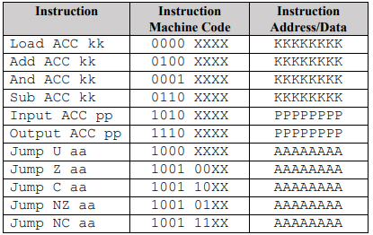

# 8-bit-CPU
Repo contains the Verilog design code as well as the code for a full system testbench (tests entire instruction set).

The 8-bit CPU utilises a Von Neumann architecture, with the memory external to the CPU and housing
both the instructions and data. The CPU operates in a Fetch, Decode, Execute and Increment cycle –
i.e., Fetch the next instruction from memory, decode or parse the instruction, execute the desired
operation for that instruction, and increment to the address of the next instruction.

Design can be simulated on https://www.edaplayground.com/x/tvqx.

The instruction set for the machine is:              

‘X’ stands for ‘Don’t care’, ‘K’ stands for any data constant, ‘P’ stands for a memory address
where data is stored, and ‘A’ stands for the next address the program counter should ‘jump’ to (if the
condition is met).

A demonstration of a set of instructions is shown in CPU_Testbench.v.
